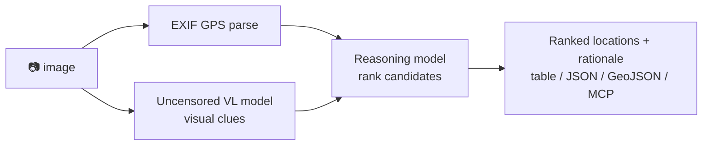

<a name="top"></a>
<div align="center">


# locateanything

### Drop in a photo → get ranked location guesses. 100% local, powered by an uncensored vision + reasoning model.

[](LICENSE)   [](https://github.com/cognis-digital/cognis-neural-suite)

`#osint` `#geoint` `#geolocation` `#llm` `#vision` `#self-hosted`

</div>

A local **GeoGuessr-for-real-life**: it reads EXIF GPS *and* reasons over visual clues (signage, plates,
architecture, flora, sun position) using a local **uncensored vision-language model** + a **reasoning model** —
no cloud, no API keys, nothing uploaded.

```bash
pip install "cognis-locateanything[img]"
fleet up vision reasoning      # via https://github.com/cognis-digital/uncensored-fleet
locate photo.jpg               # → ranked candidates + rationale
locate photo.jpg --format json
locate photo.jpg --exif-only --format geojson   # offline EXIF fix, straight onto a map
```

### Output formats
| `--format` | use |
|---|---|
| `table` (default) | human-readable ranked candidates |
| `json` | machine-readable, for pipelines / evidence logs |
| `geojson` | RFC 7946 `FeatureCollection` — open in QGIS, Leaflet, Mapbox, [geojson.io](https://geojson.io) |

`--exif-only` is a deterministic, **offline, model-free** run that uses only the
embedded EXIF GPS fix — ideal for CI, batch triage, or air-gapped review.


<!-- cognis:example:start -->
## 🔎 Example output

Real, reproducible output from the tool — runs offline:

```console
$ locateanything-emit --version
locateanything 0.1.0
```

```console
$ locateanything-emit --help
usage: locate [-h] [--version] [--format {table,json,geojson}] [--exif-only]
              image

Infer where a photo was taken (local VL + reasoning model).

positional arguments:
  image                 path to an image

options:
  -h, --help            show this help message and exit
  --version             show program's version number and exit
  --format {table,json,geojson}
  --exif-only           offline, deterministic: use only embedded EXIF GPS,
                        skip the VL/reasoning models
```

> Blocks above are real `locateanything` output — reproduce them from a clone.

**Sample result format** _(illustrative values — run on your own data for real findings):_

```
{
"findings": [
    {
        "id": "1234567890",
        "title": "Suspicious Activity Detected",
        "description": "An unknown actor has been observed attempting to access a sensitive system.",
        "created_at": "2023-02-15T14:30:00Z",
        "updated_at": "2023-02-15T14:30:00Z",
        "labels": ["suspicious", "malware"],
        "indicators": [
            {
                "type": "ip",
                "value": "192.0.2.1"
            },
            {
                "type": "domain",
                "value": "example.com"
            }
        ]
    }
]
}
```

<!-- cognis:example:end -->

## Usage — step by step

1. Install the CLI (console-script: `locate`):
   ```bash
   pipx install "git+https://github.com/cognis-digital/locateanything.git"
   locate --version
   ```
2. Infer where a photo was taken (runs entirely on a local vision + reasoning model):
   ```bash
   locate ./photo.jpg
   ```
3. Get machine-readable output for pipelines or evidence logs:
   ```bash
   locate ./photo.jpg --format json > location.json
   ```
4. Read the result — parse the JSON for the inferred location and rationale:
   ```bash
   jq '.' location.json
   ```
5. In CI/batch, loop over a folder of images and collect findings:
   ```bash
   for f in images/*.jpg; do locate "$f" --format json; done > all_locations.jsonl
   ```

## Demos
Worked, runnable scenarios live in [`demos/`](demos/) — each has a `SCENARIO.md` and,
where relevant, a sample image carrying a real public landmark coordinate in EXIF so you
can run it end-to-end offline with `--exif-only`. (Re)generate the sample images with
`python scripts/make_demo_images.py`.

| # | Scenario |
|---|---|
| [01](demos/01-basic) | Basic run — full VL + reasoning |
| [02](demos/02-exif-gps-landmark) | EXIF GPS fix, offline (no models needed) |
| [03](demos/03-batch-folder) | Batch a folder into JSONL |
| [04](demos/04-geojson-map) | GeoJSON export → drop straight onto a map |
| [05](demos/05-southern-western) | Southern + Western hemisphere (sign handling) |
| [06](demos/06-disaster-response) | Disaster-response / situational awareness |
| [07](demos/07-maritime-port) | Maritime / port geolocation (suite interop) |
| [08](demos/08-evidence-chain) | Evidence chain + forward to STIX/MISP/Slack |
| [09](demos/09-visual-clues-only) | No EXIF → visual-clue inference |

## Architecture



## Use it from any AI stack
- **MCP server** (`locate mcp`) for Claude Desktop / Cursor / [uncensored-fleet](https://github.com/cognis-digital/uncensored-fleet)
- **JSON** output pipes into any agent · **LangChain/CrewAI** tool in one line · plain **CLI**

## ⚠️ Responsible use
For OSINT, journalism, and research. **Get consent** before geolocating images of people or private
property, and comply with local law. You are responsible for your use.

## Related
[🤖 uncensored-fleet](https://github.com/cognis-digital/uncensored-fleet) · [🧠 engram](https://github.com/cognis-digital/engram) · [🔍 geolens](https://github.com/cognis-digital/geolens) · [🗂️ the suite](https://github.com/cognis-digital/cognis-neural-suite)

> ### ⭐ If this is cool, star it — it helps others find it.

## Interoperability

`locateanything` composes with the 300+ tool Cognis suite — JSON in/out and a shared
OpenAI-compatible `/v1` backbone. See **[INTEROP.md](INTEROP.md)** for the
suite map, composition patterns, and reference stacks.

## Integrations

Forward `locateanything`'s findings to STIX/MISP/Sigma/Splunk/Elastic/Slack/webhooks via
[`cognis-connect`](https://github.com/cognis-digital/cognis-connect). See **[INTEGRATIONS.md](INTEGRATIONS.md)**.

## License
COCL v1.0 — see [LICENSE](LICENSE).
