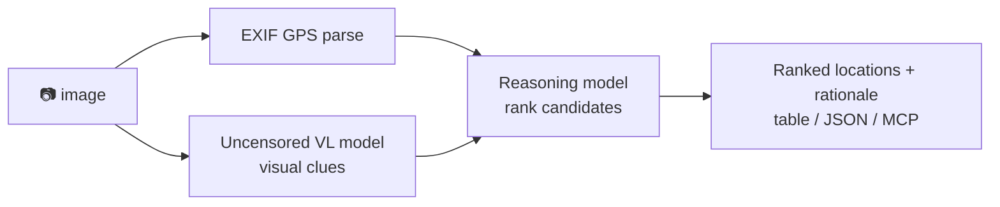

<a name="top"></a>
<div align="center">


# locateanything

### Drop in a photo → get ranked location guesses. 100% local, powered by an uncensored vision + reasoning model.

[](LICENSE)   [](https://github.com/cognis-digital/cognis-neural-suite)

`#osint` `#geoint` `#geolocation` `#llm` `#vision` `#self-hosted`

</div>

A local **GeoGuessr-for-real-life**: it reads EXIF GPS *and* reasons over visual clues (signage, plates,
architecture, flora, sun position) using a local **uncensored vision-language model** + a **reasoning model** —
no cloud, no API keys, nothing uploaded.

```bash
pip install "cognis-locateanything[img]"
fleet up vision reasoning      # via https://github.com/cognis-digital/uncensored-fleet
locate photo.jpg               # → ranked candidates + rationale
locate photo.jpg --format json
```

<!-- cognis:layman:start -->
## What is this?

locateanything is a command-line tool that figures out where a photo was taken. You point it at any image file, and it reads location data embedded in the photo and examines visual clues like road signs, building styles, and vegetation to give you a ranked list of likely locations. It runs entirely on your own computer — nothing is uploaded anywhere and no account or API key is needed. It is aimed at journalists, researchers, and OSINT analysts who need to verify or trace the origin of images.
<!-- cognis:layman:end -->

## Architecture



## Use it from any AI stack
- **MCP server** (`locate mcp`) for Claude Desktop / Cursor / [uncensored-fleet](https://github.com/cognis-digital/uncensored-fleet)
- **JSON** output pipes into any agent · **LangChain/CrewAI** tool in one line · plain **CLI**

## ⚠️ Responsible use
For OSINT, journalism, and research. **Get consent** before geolocating images of people or private
property, and comply with local law. You are responsible for your use.

<a name="verification"></a>
<!-- cognis:install:start -->
## Install

`locateanything` is source-available (not published to PyPI) — every method below installs
straight from GitHub. Pick whichever you prefer; the one-line scripts auto-detect
the best tool available on your machine.

**One-liner (Linux / macOS):**
```sh
curl -fsSL https://raw.githubusercontent.com/cognis-digital/locateanything/HEAD/install.sh | sh
```

**One-liner (Windows PowerShell):**
```powershell
irm https://raw.githubusercontent.com/cognis-digital/locateanything/HEAD/install.ps1 | iex
```

**Or install manually — any one of:**
```sh
pipx install "git+https://github.com/cognis-digital/locateanything.git"     # isolated (recommended)
uv tool install "git+https://github.com/cognis-digital/locateanything.git"  # uv
pip install "git+https://github.com/cognis-digital/locateanything.git"      # pip
```

**From source:**
```sh
git clone https://github.com/cognis-digital/locateanything.git
cd locateanything && pip install .
```

Then run:
```sh
locate --help
```
<!-- cognis:install:end -->

## Verification

[](AUDIT.md)

Every push is verified end-to-end. Latest audit (2026-06-13):

```text
tests        : 1 passed, 0 failed, 0 errored
compile      : all modules parse
cli          : C:\Python314\python.exe: No module named https
package      : https
```

<details><summary>CLI surface (<code>--help</code>)</summary>

```text
C:\Python314\python.exe: No module named https
```
</details>

Full machine-readable results: [`AUDIT.md`](AUDIT.md) · regenerate with `python -m https --help` + `pytest -q`.

<div align="right"><a href="#top">↑ back to top</a></div>


## Related
[🤖 uncensored-fleet](https://github.com/cognis-digital/uncensored-fleet) · [🧠 engram](https://github.com/cognis-digital/engram) · [🔍 geolens](https://github.com/cognis-digital/geolens) · [🗂️ the suite](https://github.com/cognis-digital/cognis-neural-suite)

> ### ⭐ If this is cool, star it — it helps others find it.

## License
COCL v1.0 — see [LICENSE](LICENSE).
