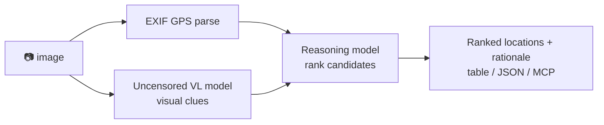

<a name="top"></a>
<div align="center">


# locateanything

### Drop in a photo → get ranked location guesses. 100% local, powered by an uncensored vision + reasoning model.

[](LICENSE)   [](https://github.com/cognis-digital/cognis-neural-suite)

`#osint` `#geoint` `#geolocation` `#llm` `#vision` `#self-hosted`

</div>

A local **GeoGuessr-for-real-life**: it reads EXIF GPS *and* reasons over visual clues (signage, plates,
architecture, flora, sun position) using a local **uncensored vision-language model** + a **reasoning model** —
no cloud, no API keys, nothing uploaded.

```bash
pip install "cognis-locateanything[img]"
fleet up vision reasoning      # via https://github.com/cognis-digital/uncensored-fleet
locate photo.jpg               # → ranked candidates + rationale
locate photo.jpg --format json
```

## Architecture



## Use it from any AI stack
- **MCP server** (`locate mcp`) for Claude Desktop / Cursor / [uncensored-fleet](https://github.com/cognis-digital/uncensored-fleet)
- **JSON** output pipes into any agent · **LangChain/CrewAI** tool in one line · plain **CLI**

## ⚠️ Responsible use
For OSINT, journalism, and research. **Get consent** before geolocating images of people or private
property, and comply with local law. You are responsible for your use.

## Related
[🤖 uncensored-fleet](https://github.com/cognis-digital/uncensored-fleet) · [🧠 engram](https://github.com/cognis-digital/engram) · [🔍 geolens](https://github.com/cognis-digital/geolens) · [🗂️ the suite](https://github.com/cognis-digital/cognis-neural-suite)

> ### ⭐ If this is cool, star it — it helps others find it.

## License
COCL v1.0 — see [LICENSE](LICENSE).
